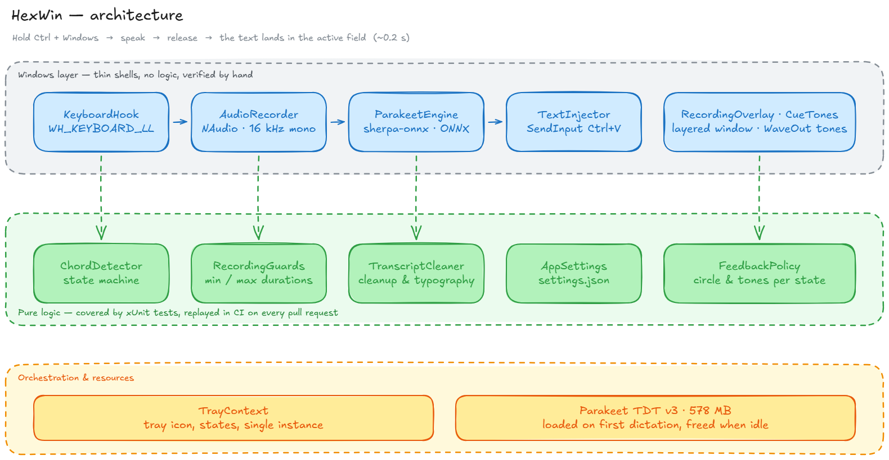

# HexWin

Dictée vocale locale pour Windows. On maintient **`Ctrl` + `Windows`**, on parle,
on relâche : le texte s'insère dans le champ actif.

Tout tourne **sur la machine** — aucun envoi vers un service en ligne, aucun
abonnement, aucune connexion nécessaire une fois le modèle téléchargé.



## Ce que ça donne

Mesuré sur un Dell Pro Max 16 (Core Ultra 7 255H), sur processeur :

| Durée de la dictée | Attente après relâchement |
|--------------------|---------------------------|
| 0,6 s | 0,05 s |
| 1,6 s | 0,08 s |
| 5 s | 0,19 s |
| 40 s | 1,58 s |

Le moteur est **Parakeet TDT v3** de NVIDIA, celui qu'utilise [Hex](https://github.com/kitlangton/Hex)
sur macOS. Il reconnaît seul la langue parlée parmi 25 langues européennes,
français compris : il n'y a aucun réglage de langue à faire.

## Installation

### Si vous ne voulez rien compiler

Téléchargez l'archive de la [dernière version](https://github.com/legb78/hex_windows/releases),
décompressez-la, puis dans PowerShell :

```powershell
.\get-model.ps1     # environ 480 Mo, une seule fois
.\HexWin.exe
```

Rien d'autre à installer — pas même .NET, il est embarqué dans l'exécutable.

### Si vous compilez vous-même

Il faut le **SDK .NET 9** (<https://dotnet.microsoft.com/download>).

```powershell
.\scripts\get-model.ps1     # télécharge le modèle
dotnet build -c Release
.\src\HexWin\bin\x64\Release\net9.0-windows\HexWin.exe
```

## Utilisation

L'icône de la barre système indique l'état :

| Couleur | État |
|---------|------|
| Gris | Chargement du modèle, quelques secondes au démarrage |
| Bleu | Prêt |
| Rouge | Enregistrement en cours |
| Orange | Transcription en cours |
| Gris barré | Modèle introuvable |

Maintenez `Ctrl` + `Windows`, parlez, relâchez. Le texte arrive au curseur.

Le clic droit sur l'icône donne accès à la configuration, au journal, et au
lancement automatique à l'ouverture de session.

## Réglages

Tout se passe dans `settings.json`, à côté de l'exécutable. Les commentaires y
sont autorisés, et **une valeur invalide est remplacée par son défaut** plutôt
que d'empêcher le démarrage.

| Réglage | Rôle |
|---------|------|
| `hotkey` | Touches à maintenir. La touche `Fn` n'est pas utilisable : elle est gérée par le contrôleur du clavier et n'émet aucun code visible par Windows. |
| `insertion` | `Paste` (presse-papiers, instantané) ou `Type` (frappe simulée, pour les applications qui ignorent le collage). |
| `provider` | `cpu`. Seul disponible : les bibliothèques natives publiées ne sont compilées que pour le processeur. |
| `threads` | Fils alloués au décodage. |
| `minRecordingMilliseconds` | En deçà, l'appui est considéré comme accidentel. |
| `maxRecordingSeconds` | Coupe l'enregistrement si la touche reste enfoncée. |

## En cas de problème

Trois modes de diagnostic, à lancer dans cet ordre — chacun isole une couche.

```powershell
# 1. Le micro capte-t-il quelque chose ?
.\HexWin.exe --record test.wav

# 2. Le moteur transcrit-il ?
.\HexWin.exe --transcribe test.wav

# 3. Le raccourci se déclenche-t-il ?
.\HexWin.exe --watch-hotkey

# et pour l'insertion seule
.\HexWin.exe --inject "du texte"
```

Le premier est le réflexe le plus utile : un micro coupé ou interdit par les
réglages de confidentialité produit un fichier parfaitement valide, de la
bonne durée, et totalement silencieux. Sans le niveau affiché, on chercherait
la panne du côté de la transcription.

Le journal se trouve dans `%LOCALAPPDATA%\HexWin`.

### Limites connues

- **Fenêtres administrateur** : une application non élevée ne peut pas envoyer
  de frappes à une fenêtre lancée en administrateur. Lancez HexWin en
  administrateur si le besoin se présente.
- **Antivirus** : un hook clavier global est un motif que certains antivirus
  signalent. Une exclusion sur l'exécutable peut être nécessaire.

## Développement

```powershell
dotnet build -c Release     # aucun avertissement toléré
dotnet test                 # tests unitaires
```

Les tests d'intégration chargent réellement le moteur et ne tournent pas en CI :

```powershell
dotnet test --filter Category=Integration
```

### Organisation du code

L'architecture sépare délibérément deux couches, pour une raison de testabilité
(schéma ci-dessus, source éditable dans [docs/architecture.excalidraw](docs/architecture.excalidraw)) :

- **Les coquilles Windows** (`KeyboardHook`, `AudioRecorder`, `ParakeetEngine`,
  `TextInjector`) branchent des API système et ne décident rien. Elles ne sont
  pas testables en automatique — pas de micro ni de session interactive sur un
  serveur d'intégration continue — et se vérifient à la main.
- **La logique pure** (`ChordDetector`, `RecordingGuards`, `TranscriptCleaner`,
  `AppSettings`, `DictationCoordinator`) contient toutes les décisions et se
  teste sans Windows. C'est là que vivent les bugs coûteux : répétition
  automatique du clavier, relâchement de touche dans le désordre, touche restée
  enfoncée après un verrouillage de session, seconde dictée déclenchée pendant
  qu'une transcription tourne encore.

### Contribution

Deux branches au long cours :

| Branche | Rôle |
|---------|------|
| `main` | Versions publiées. N'avance que depuis `develop`. |
| `develop` | Intégration. C'est là que les branches de travail sont fusionnées. |

Une branche par changement, créée **depuis `develop`** et fusionnée vers
`develop` : `feat/`, `fix/`, `chore/`, `ci/`, `docs/`. Messages en
[Conventional Commits](https://www.conventionalcommits.org/fr/), fusion en
*squash*.

```powershell
git checkout develop
git pull
git checkout -b feat/mon-sujet
gh pr create --base develop
```

### Publier une version

```powershell
.\scripts\publish.ps1        # produit l'exécutable autonome en local
```

Une étiquette `v*` poussée sur `main` déclenche la publication automatique et
attache l'archive à la Release GitHub.

Le détail du flux de contribution se trouve dans [CONTRIBUTING.md](CONTRIBUTING.md).

## Licence

HexWin est distribué sous licence [Apache 2.0](LICENSE).

Le moteur de reconnaissance est **Parakeet TDT 0.6B v3**, de NVIDIA, distribué
sous licence CC-BY-4.0 — usage commercial autorisé. Les autres composants
(sherpa-onnx, ONNX Runtime, NAudio, .NET) sont sous licences Apache 2.0 ou MIT.

Le détail des attributions figure dans [NOTICE](NOTICE).
